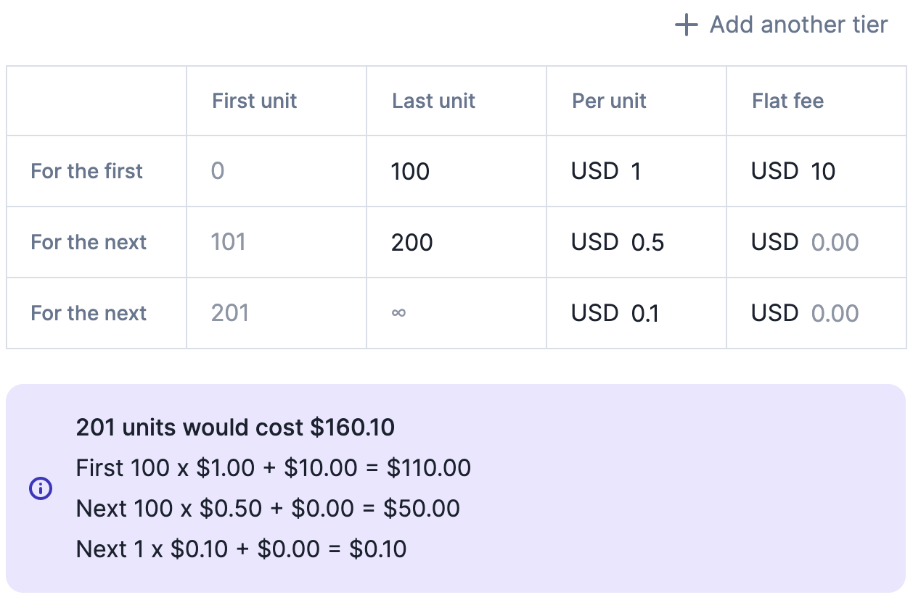
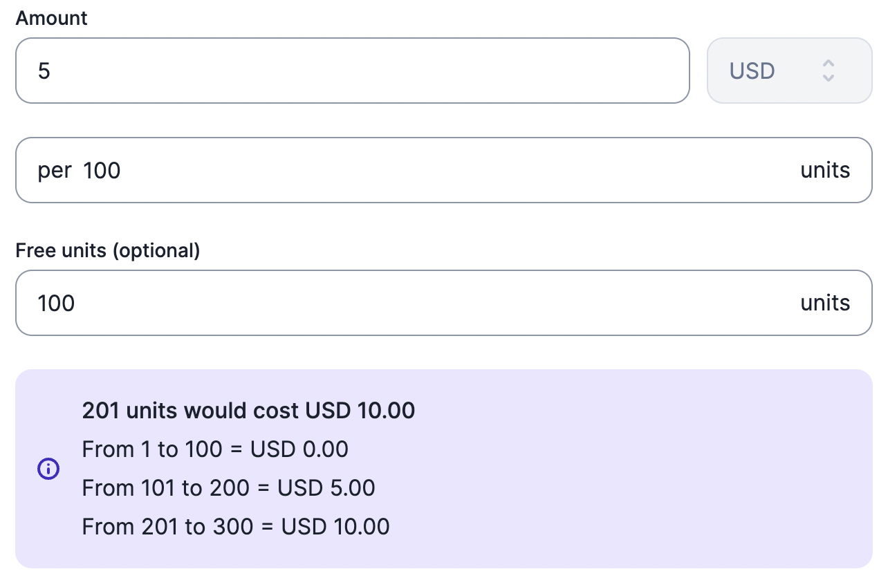

# Charges
In addition to the price of a Plan, your Customers could pay for per-usage features. For instance, they could pay for API calls, storage, computes...

**This additional charges are related to the Billable metrics you already defined**. If you don't know how Billable metrics work for "pay-as-you-go" features, please visit [this section of the documentation](../billable-metrics/overview). Obviously, this additional charges related to your Billable metrics can be priced differently regarding the Plans they belong to.

## Overview of charges
You can add Charges to a Plan by calling an existing Billable metric (you will need to define how you want to price this addtional Charge).

These additional charges are often "pay-as-you-go" features and can be called in multiple Plans with a different price.

:::caution
- These additional charges are always paid `in arrears` because they are linked to an actual consumption
- These additional charges **are priced with the same currency** than the Plan's currency
- The additional charges **are not subject to the trial period**. The trial period is only for the Plan base amount
:::

You have several charge model options to price these additional charges (following below).

## Number of decimals for charges
Lago lets you create charges with 5 decimals as a maximum (example: $0.00012). It gives you the flexibility to charge features with a high granularity, especially if you are running a cloud company. 

It's useful to mention that all charges are invoiced in `amount_cents`. Thus, Lago automatically rounds the price to be charged (example: USD 1102 `amount_cents` = $11.02).

## The Standard charge model
Select a **standard charge model** if you charge the same price for each unit consumed. This charge model can be applied only for additional charges triggered by your [Billable metrics](../billable-metrics/overview).

For instance, let's imagine you are an API company charging $0.05 for each API call (your defined Billable metric). By selecting a standard charge model, each API call will be charged the same amount. If a customer does 1000 API calls during a billing period, the total amount invoiced will be $50 ($0.05 x 1000 API calls).

## The Graduated charge model
Select a **graduated charge model** if you want to **apply a different price per unit** following a pricing scale. This charge model is very useful when you need to apply a discount regarding how much units of your product are being consumed by a customer. In addition to this price per unit, you can decide to apply a **flat fee** to an entire tier.

Let's take back the example of an API company. You might charge $1.00 per unit for the first 100 units (100 first API calls). Then $0.50 per unit for the next 100. Eventually $0.10 for all the units above. Take more concrete look at this example in the below image.

In any case, the Lago UI will guide you (by providing you an exact quote) if you need to apply a graduated logic to a specific charge (just have a look at the purple tooltip in the image below).

## The Package charge model
Select a **package charge model** if you want to apply a price to a range of units. This charge model is useful when you want to apply the same price to a set of units. You also have the option to offer free units.

Let's take back the example of our API company. You might want to price $5.00 per 100 units and offer the first 100 units. In this instance, 201 units would cost $10.00: $0.00 (100 first units) + $5.00 (next 100 units) + $5.00 (one additional unit).

